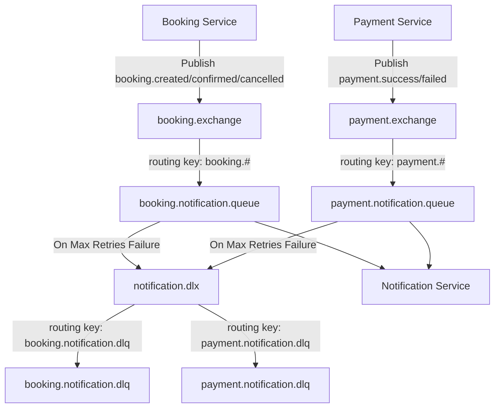

# Implementation Plan — Module 9: RabbitMQ & Notification Service

Introduce asynchronous, message-driven notification support using **RabbitMQ** to decouple notifications (email, SMS, push) from core booking and payment transaction flows.

---

## Proposed Architectural Design

### 1. RabbitMQ Topology

### 2. Dead-Letter Queue & Retries
- Configured with `SimpleMessageListenerContainer` retries:
  - Max retries: 3
  - Initial interval: 1000ms
  - Multiplier: 2.0 (exponential backoff)
- After 3 failed processing attempts, messages are automatically routed to the Dead Letter Exchange (`notification.dlx`) and stored in the respective `.dlq` queues for manual inspection or replays.

---

## Proposed Changes

### Component 1: Shared Foundation (`shared` module)

#### [NEW] `com.turfconnect.shared.dto.event.BookingEvent`
Event object containing:
- `bookingId` (String)
- `userId` (String)
- `turfName` (String)
- `date` (LocalDate)
- `startTime` (LocalTime)
- `endTime` (LocalTime)
- `totalPrice` (BigDecimal)
- `status` (BookingStatus)
- `eventType` (String) — `CREATED`, `CONFIRMED`, `CANCELLED`
- `timestamp` (LocalDateTime)

#### [NEW] `com.turfconnect.shared.dto.event.PaymentEvent`
Event object containing:
- `transactionId` (String)
- `bookingId` (String)
- `amount` (BigDecimal)
- `currency` (String)
- `status` (PaymentStatus)
- `eventType` (String) — `SUCCESS`, `FAILED`
- `timestamp` (LocalDateTime)

---

### Component 2: Notification Microservice (`notification-service` module)

#### [NEW] [pom.xml](file:///c:/Users/rohit/TurfConnect/backend/notification-service/pom.xml)
Maven configuration containing:
- Parent: `turfconnect-parent`
- Dependencies: `spring-boot-starter-amqp`, `spring-boot-starter-web`, `shared`

#### [NEW] [application.yml](file:///c:/Users/rohit/TurfConnect/backend/notification-service/src/main/resources/application.yml)
- Server Port: `8085`
- Database: None (stateless service)
- Config import: shared profile configurations

#### [NEW] `com.turfconnect.notification.config.RabbitMQConfig`
Defines AMQP components:
- Queue, Exchange, DLQ, and DLX declarations
- Jackson `MessageConverter` bean for transparent JSON serialization/deserialization.

#### [NEW] `com.turfconnect.notification.listener.NotificationListener`
Consumes RabbitMQ queues using `@RabbitListener`:
- `booking.notification.queue` -> logs simulated email/SMS alerts to the terminal for user confirmations.
- `payment.notification.queue` -> logs simulated receipt/receipt-failure notification alerts.

---

### Component 3: Booking Microservice (`booking-service`)

#### [MODIFY] [pom.xml](file:///c:/Users/rohit/TurfConnect/backend/booking-service/pom.xml)
- Add `spring-boot-starter-amqp` dependency.

#### [NEW] `com.turfconnect.booking.config.RabbitMQConfig`
- Configures `RabbitTemplate` to use JSON `MessageConverter` for event publications.
- Declares the topic exchange `booking.exchange`.

#### [MODIFY] `com.turfconnect.booking.service.BookingService`
- Inject `RabbitTemplate`.
- Publish `BookingEvent` to `booking.exchange` with routing key `booking.created` upon booking creation, `booking.confirmed` upon payment confirmation, and `booking.cancelled` upon payment failure callbacks.

---

### Component 4: Payment Microservice (`payment-service`)

#### [MODIFY] [pom.xml](file:///c:/Users/rohit/TurfConnect/backend/payment-service/pom.xml)
- Add `spring-boot-starter-amqp` dependency.

#### [NEW] `com.turfconnect.payment.config.RabbitMQConfig`
- Configures `RabbitTemplate` with Jackson JSON converter.
- Declares topic exchange `payment.exchange`.

#### [MODIFY] `com.turfconnect.payment.service.PaymentService`
- Inject `RabbitTemplate`.
- Publish `PaymentEvent` to `payment.exchange` with routing key `payment.success` or `payment.failed` inside webhook handlers.

---

## Verification Plan

### Automated Tests
1. **Unit Tests in Notification Service:** Validate message deserialization and notification routing.
2. **Event Publishing Tests:** Assert that `booking-service` and `payment-service` call `rabbitTemplate.convertAndSend(...)` when booking state transitions occur.

### Manual Verification
1. Start RabbitMQ locally (e.g., inside WSL Docker or standard system installation).
2. Start the new `notification-service`.
3. Run the complete booking checkout workflow:
   - Browse slot -> click checkout -> simulate mock card checkout.
4. Verify the terminal outputs of `notification-service`:
   - Inspect that `Booking PENDING` log, `Payment SUCCESS` log, and `Booking CONFIRMED` messages are logged asynchronously in real-time.
