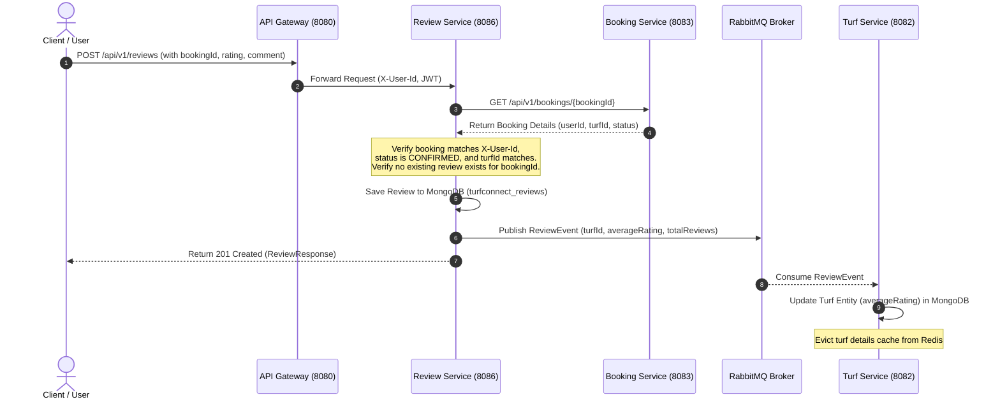

# Implementation Plan — Module 10: Reviews & Ratings

Introduce a dedicated **review-service** microservice that handles user reviews and ratings for sports turfs. Reviews will be secured by verifying bookings, preventing duplicate submissions, and propagating average rating metrics to the `turf-service` asynchronously using RabbitMQ events.

---

## Proposed Architectural Design

### 1. Verification and Event Flow

### 2. Database Schema (review-service)
- **Database:** MongoDB (`turfconnect_reviews` database)
- **Collection:** `reviews`
- **Fields:**
  - `id` (String / ObjectId)
  - `userId` (String) - indexed
  - `bookingId` (String) - unique index to prevent double reviews
  - `turfId` (String) - indexed
  - `rating` (Integer, 1-5)
  - `comment` (String)
  - `createdAt` (LocalDateTime)

---

## Proposed Changes

### Component 1: Shared Library (`shared` module)

#### [NEW] `com.turfconnect.shared.dto.review.ReviewCreateRequest`
DTO containing:
- `bookingId` (String, required)
- `rating` (Integer, required, 1 to 5)
- `comment` (String, optional)

#### [NEW] `com.turfconnect.shared.dto.review.ReviewResponse`
DTO containing:
- `id` (String)
- `userId` (String)
- `bookingId` (String)
- `turfId` (String)
- `rating` (Integer)
- `comment` (String)
- `createdAt` (LocalDateTime)

#### [NEW] `com.turfconnect.shared.dto.event.ReviewEvent`
RabbitMQ event published to `review.exchange` on routing key `review.updated`:
- `turfId` (String)
- `averageRating` (Double)
- `totalReviews` (Integer)
- `timestamp` (LocalDateTime)

---

### Component 2: API Gateway (`api-gateway`)

#### [MODIFY] [application.yml](file:///c:/Users/rohit/TurfConnect/backend/api-gateway/src/main/resources/application.yml)
- Map `/api/v1/reviews/**` path route to `http://localhost:8086` (Review Service).

---

### Component 3: Review Microservice (`review-service` - NEW)

#### [NEW] [pom.xml](file:///c:/Users/rohit/TurfConnect/backend/review-service/pom.xml)
Standard service dependencies:
- Parent: `turfconnect-parent`
- Dependencies: `spring-boot-starter-web`, `spring-boot-starter-data-mongodb`, `spring-boot-starter-amqp`, `spring-boot-starter-actuator`, `shared`

#### [NEW] [application.yml](file:///c:/Users/rohit/TurfConnect/backend/review-service/src/main/resources/application.yml)
- Server Port: `8086`
- Database: `turfconnect_reviews`
- Configuration import: shared profile settings

#### [NEW] `com.turfconnect.review.model.Review`
MongoDB document mapped to `reviews` collection:
- `@Indexed` on `turfId`, `userId`
- `@Indexed(unique = true)` on `bookingId`

#### [NEW] `com.turfconnect.review.config.RabbitMQConfig`
- Declares topic exchange `review.exchange`.
- Sets up JSON `MessageConverter` bean.

#### [NEW] `com.turfconnect.review.repository.ReviewRepository`
- Extends `MongoRepository<Review, String>`.
- Declares:
  - `List<Review> findByTurfId(String turfId)`
  - `Optional<Review> findByBookingId(String bookingId)`
  - `long countByTurfId(String turfId)`

#### [NEW] `com.turfconnect.review.service.ReviewService`
Core logic functions:
- `submitReview(ReviewCreateRequest request, String userId)`:
  - Check rating is within `[1, 5]`.
  - Validate if booking is already reviewed (`findByBookingId`). If yes, throw `BadRequestException`.
  - Execute REST query to `booking-service` at `GET http://localhost:8083/api/v1/bookings/{bookingId}` to check booking validity (must belong to `userId` and status must be `CONFIRMED`).
  - Save `Review` to database.
  - Calculate new average rating & count for the `turfId` from database.
  - Publish `ReviewEvent` to `review.exchange` on routing key `review.updated`.
  - Return `ReviewResponse`.
- `getReviewsForTurf(String turfId)`:
  - Fetch list of reviews.

#### [NEW] `com.turfconnect.review.controller.ReviewController`
Expose endpoints:
- `POST /api/v1/reviews` (secure with `@RequestHeader("X-User-Id")`)
- `GET /api/v1/reviews/turf/{turfId}` (public)

---

### Component 4: Turf Microservice (`turf-service`)

#### [MODIFY] [pom.xml](file:///c:/Users/rohit/TurfConnect/backend/turf-service/pom.xml)
- Add `spring-boot-starter-amqp` dependency (enables listener configuration).

#### [NEW] `com.turfconnect.turf.config.RabbitMQConfig`
- Declare queue `turf.review.queue` and exchange `review.exchange`.
- Bind `turf.review.queue` to `review.exchange` with routing key `review.#`.

#### [NEW] `com.turfconnect.turf.listener.ReviewEventListener`
- Consumes `ReviewEvent` from `turf.review.queue`.
- On message consumption, calls `turfService.updateTurfRating(turfId, averageRating)`.

#### [MODIFY] `com.turfconnect.turf.service.TurfService`
- Implement `updateTurfRating(String turfId, Double averageRating)`:
  - Fetch Turf from repository.
  - Set `averageRating` to new value.
  - Save updated Turf.
  - Evict Redis cache for this turf key (to be implemented in Module 12 or prepared now).

---

## Verification Plan

### Automated Tests
1. **Unit Tests in Review Service:**
   - Assert validation fails for ratings `< 1` or `> 5`.
   - Assert double reviews for same `bookingId` are rejected.
   - Assert booking owner verification mismatch throws `ForbiddenException`.
2. **Unit Tests in Turf Service:**
   - Verify that consumer triggers rating updates correctly on `ReviewEvent`.

### Manual Verification
1. Start the new `review-service` and restart `api-gateway` / `turf-service`.
2. Access Swagger/Postman:
   - Create a booking and confirm it (via payment verify endpoint).
   - Submit a review `POST /api/v1/reviews` with the booking ID.
   - Verify the review is saved successfully.
   - Verify that submitting a duplicate review for the same booking ID returns a `400 Bad Request`.
3. Query `GET /api/v1/turfs/{id}` and verify that the `averageRating` field has updated automatically to the correct computed average rating.
